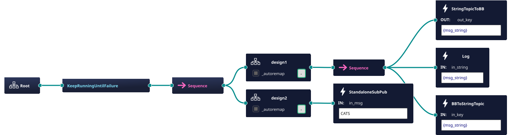

# ros_behaviortree_examples
This repo demonstrates the usage and useful software design patterns when using BehaviortreeCPP with ROS2.

## Pre-requisites

### Behavior Tree CPP
- Please read the [Basic Concepts](https://www.behaviortree.dev/docs/learn-the-basics/BT_basics) and [Tutorials (Basic)](https://www.behaviortree.dev/docs/category/tutorials-basic) before you dive into the code.

### ROS
- Please read the [ROS Tutorials](https://wiki.ros.org/ROS/Tutorials) before starting to use these examples.

## Examples
### ROS Subscribers, Publishers :left_right_arrow: Behavior Tree CPP
