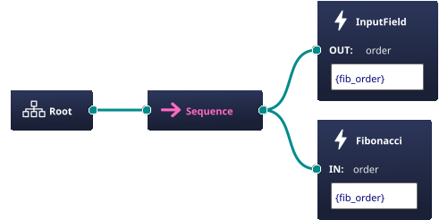

## Description
The behavior tree sends an action goal to the action server and waits for the result. During the wait period it will log the feedback received from the action server.

Asynchronous example.

## Structure


## Requirements
Require the [BehaviorTree.ROS2 packages](https://github.com/BehaviorTree/BehaviorTree.ROS2/tree/humble).

## Usage
```bash
    ./tmux/start.sh
```
