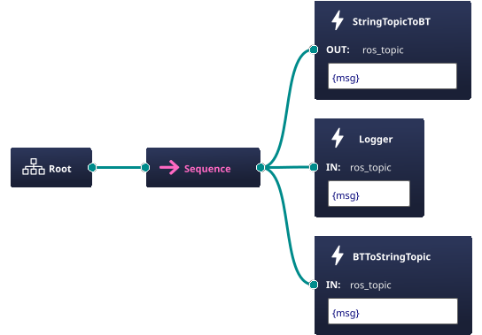

## Description
The behavior tree listens for new messages on string topic using [mrs_lib SubscribeHandler](https://ctu-mrs.github.io/mrs_lib/classmrs__lib_1_1SubscribeHandler.htmlhttps://ctu-mrs.github.io/mrs_lib/classmrs__lib_1_1SubscribeHandler.html). If there is any message, it will be logged and passed to the publisher which publishes it to another topic.

Synchronous example. Every tick of the tree will be checked if there is a message, **the tree won't wait for it**. 

## Structure


## Usage
```bash
    ./tmux/start.sh
```
